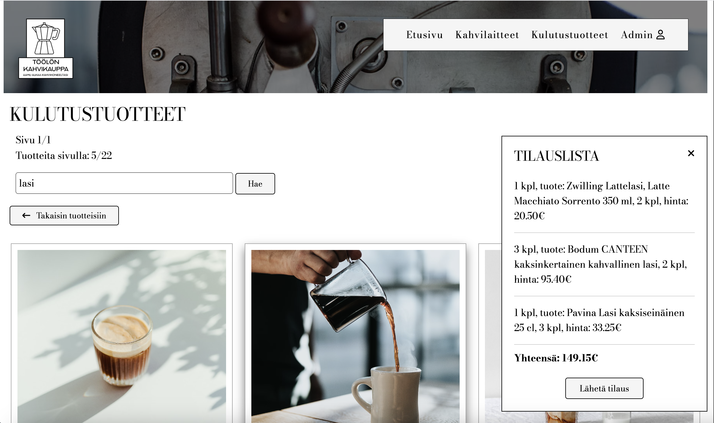
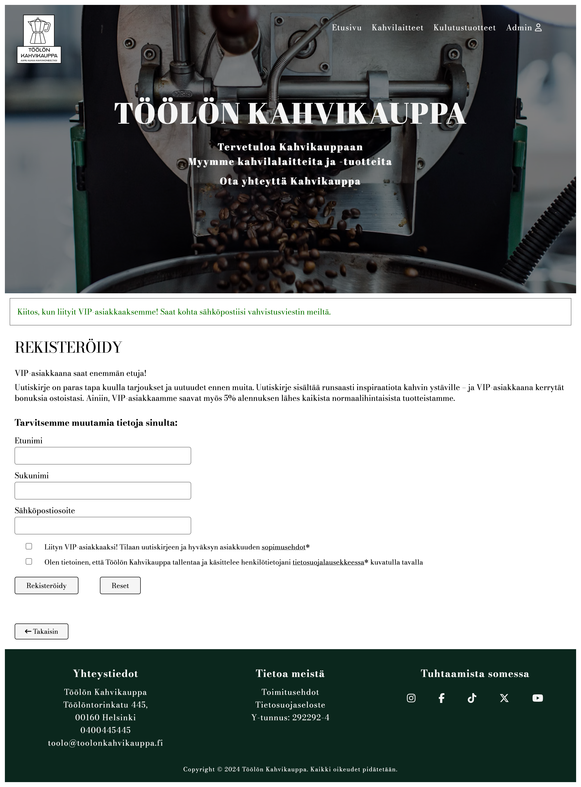
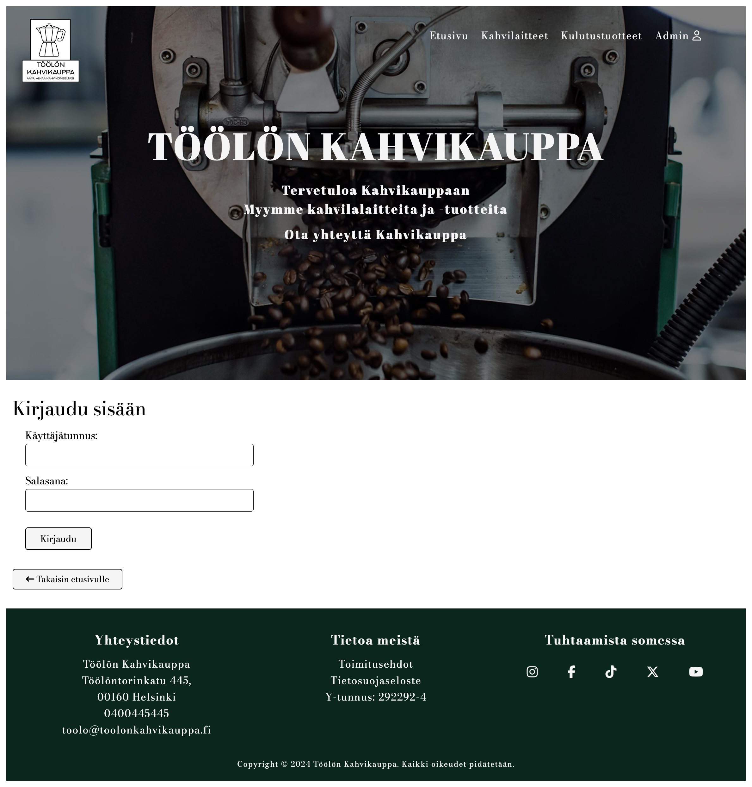
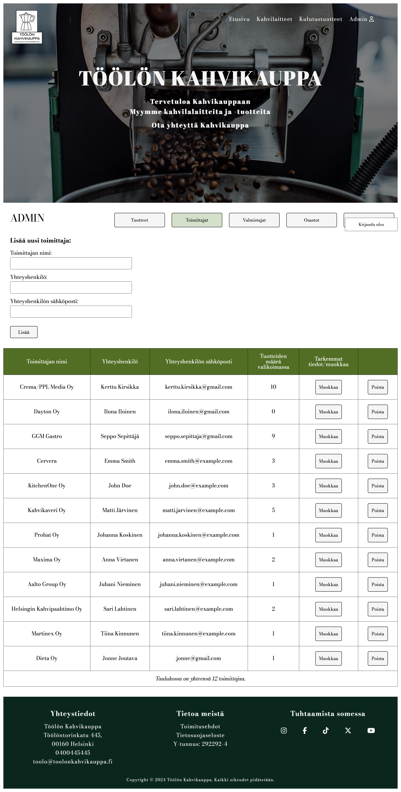
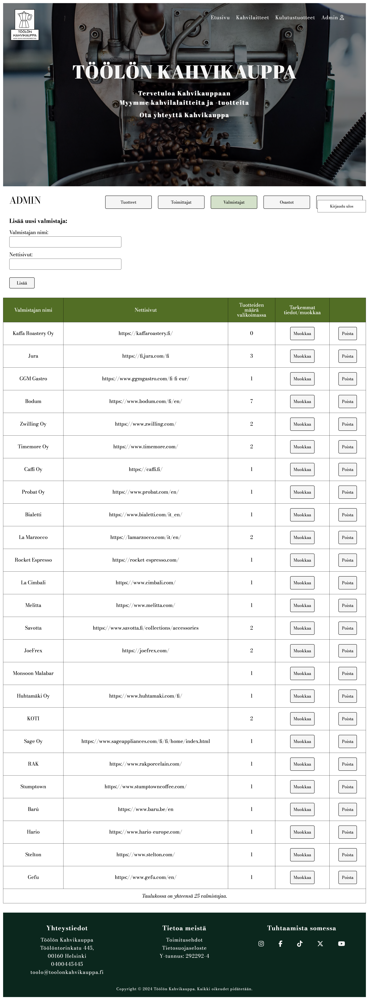
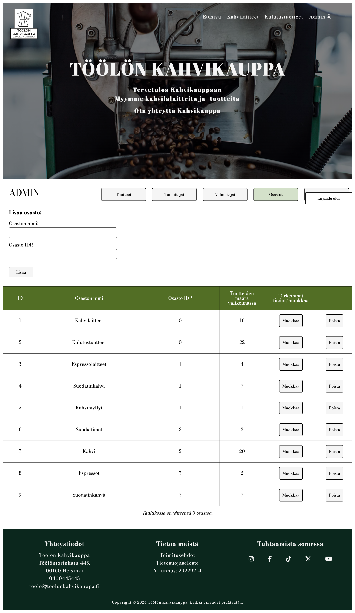
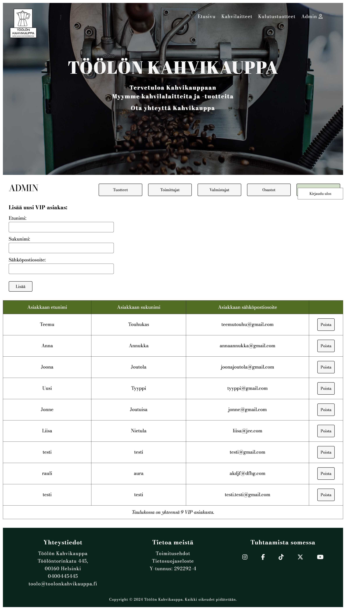

# Kahvikauppa

## Projektin kuvaus

Kahvikauppa on monipuolinen verkkosovellus, joka tarjoaa kahvikaupan hallinnolle ja asiakkaille käyttäjäystävällisen alustan tuotteiden selailuun, tilaamiseen ja hallintaan. Sovelluksen ulkoasu on itsesuunniteltu ja toteutettu niin, että käyttökokemus olisi mahdollisimman helppo ja yhtenäinen. Siisti ja yhdenmukainen tyyli näkyy kaikissa sovelluksen osissa. Sovellus tarjoaa laajan valikoiman toiminnallisuuksia, jotka mahdollistavat tuotteiden selaamisen, tehokkaan tuotehallinnan, asiakassuhteiden hallinnan (VIP-asiakasrekisteröinti) ja tilausten vastaanottamisen.

## Ominaisuudet

### Tuotteiden hallinta

Admin-käyttäjä voi lisätä, muokata ja poistaa sovelluksessa (linkitetty H2-tietokantaan) tuotteita. Jokaisella tuotteella on tarkat tiedot, kuten nimi, hinta, kuvaus, tuotekuva, sekä tuotteelle osoitetaan aina valmistaja, toimittaja ja osasto. Tallennettuja tuotteita pystyy helposti muokkaamaan ja poistamaan.

- Lisää uusia tuotteita, määrittele niiden nimi, hinta ja kuvaus.
- Muokkaa olemassa olevia tuotteita tarvittaessa.
- Poista tuotteita valikoimasta ja tietokannasta.

### Toimittajien ja valmistajien hallinta

Admin-käyttäjä voi lisätä, muokata ja poistaa sovelluksessa (linkitetty H2-tietokantaan) toimittajia ja valmistajia. Jokaiselle valmistajalle ja toimittajalle on tarkat tiedot, kuten nimi, yhteyshenkilö, verkko-osoite jne. Tallennettuja tietoja pystyy helposti muokkaamaan ja poistamaan.

- Lisää uusia toimittajia ja valmistajia, määrittele heidän nimensä, yhteystietonsa, verkko-osoitteet jne.
- Muokkaa toimittajien ja valmistajien tietoja.
- Poista toimittajia ja valmistajia tarvittaessa valikoimasta ja tietokannasta.

### Osastojen hallinta

Admin-käyttäjä voi lisätä, muokata ja poistaa sovelluksessa (linkitetty H2-tietokantaan) osastoja. Jokaiselle osastolle osoitetaan osasto IDP (parent id), jonka avulla saadaan osastohierarkia tietokantaan. Osastojen avulla tuotteet voidaan järjestää ja ryhmitellä tehokkaasti, mikä helpottaa asiakkaiden tuotteiden löytämistä ja tuotteiden listautumista omille html-sivuilleen.

- Luo uusia osastoja, määrittele niiden nimi ja osasto IDP (parent id:s).
- Muokkaa osastojen tietoja.
- Poista osastoja valikoimasta ja tietokannasta.

### VIP-asiakkaiden hallinta

Sovellus tarjoaa asiakkaalle mahdollisuuden rekisteröityä VIP-asiakkaaksi. Admin-käyttäjät voivat hallinnoida rekisteröityneitä VIP-asiakkaita (linkitetty H2-tietokantaan) sovelluksessa.

- Rekisteröi uusia VIP-asiakkaita, määrittele heidän etunimensä, sukunimensä ja sähköpostiosoitteensa.
- Poista VIP-asiakkaita tarvittaessa.

### Käyttäjähallinta

Kahvikaupan hallintapaneeliin pääseminen edellyttää sisäänkirjautumista admin-tunnuksilla. Sisäänkirjautumisen avulla varmistetaan, että vain valtuutetut henkilöt voivat käyttää hallintapaneelia ja suorittaa erilaisia hallinnollisia toimenpiteitä.

- Käyttäjätunnus ja salasana syötetään sisäänkirjautumislomakkeelle.
- Sisäänkirjautumistiedot lähetetään turvallisesti palvelimelle.
- Palvelin tarkistaa käyttäjän antamat tiedot ja varmistaa, että ne ovat oikein.
- Jos tunnistautuminen onnistuu, käyttäjä ohjataan hallintapaneeliin, jossa hän voi suorittaa erilaisia toimenpiteitä.
- Jos tunnistautuminen epäonnistuu, käyttäjä saa virheilmoituksen ja ohjataan takaisin sisäänkirjautumissivulle yrittämään uudelleen.

Sisäänkirjautumistoiminnallisuus on olennainen osa kahvikaupan turvallisuutta ja käyttäjähallintaa, ja se varmistaa, että vain oikeutetut henkilöt voivat käyttää hallintapaneelia ja sen tarjoamia toiminnallisuuksia.

Tämä sisäänkirjautumistoiminnallisuus on toteutettu Spring Security -kirjaston avulla, joka tarjoaa vahvan tunnistautumisen ja autorisoinnin mekanismit web-sovelluksille. Sisäänkirjautumistoiminnallisuus on integroitu osaksi kahvikaupan backendiä, ja se varmistaa käyttäjätunnuksen ja salasanan oikeellisuuden ennen kuin käyttäjä pääsee käyttämään hallintapaneelia.

- Sisäänkirjautuminen admin-tunnuksilla mahdollistaa hallintapaneelin käytön.

## Teknologiat ja kirjastot

Projekti hyödyntää laajasti Java-pohjaisia teknologioita ja Spring Frameworkin eri osia backendin toteuttamiseen. Frontendissä käytetään perinteisiä web-tekniikoita, kuten HTML:ää, CSS:ää sekä JavaScriptiä ja Thymeleafia dynaamisen sisällön renderöintiin sekä H2-tietokantaa tietojen tallentamiseen ja hallintaan.

- Kieli: Java
- Frontend: HTML, CSS, JavaScript
- Backend: Spring Boot, Spring Boot DevTools, Lombok, Spring Web, Thymeleaf, Spring Data JPA
- Tietokanta: H2 Database

## Näyttökuvia sovelluksesta

### Etusivu

### Kulutustuotteet-osasto

### Kahvilaitteet-osasto

### Tilaukset ja haku

### VIP-asiakasrekisteröinti

### Sisäänkirjautuminen

### Tuotteiden hallinta

### Toimittajien hallinta

### Valmistajien hallinta

### Osastojen hallinta

### VIP-asiakkaiden hallinta

